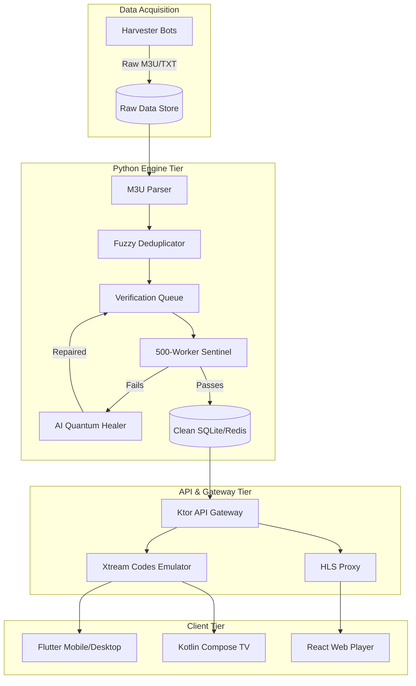
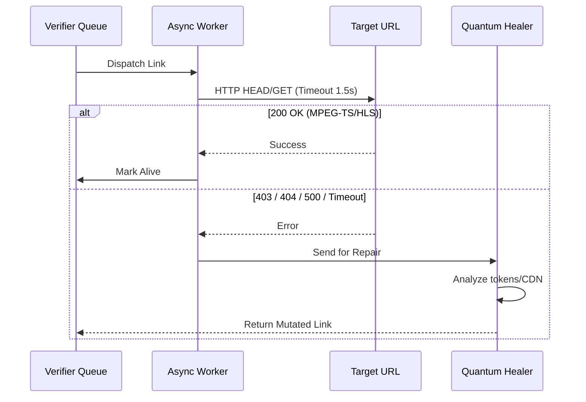

# 📐 Architecture Specification

This document details the low-level architectural design of the **ALL-IN-One IPTV** ecosystem.

## 🔄 Data Flow Diagrams

### High-Level Component Diagram



### Stream Verification Sequence



## 🧠 AI Quantum Healer & Fallback Mechanics

The **AI Quantum Healer** is a deterministic, heuristic engine designed to repair streams.

### Scoring Formula
Every stream is assigned a Quantum Reliability Score ($QRS$):

$$ QRS = w_1 S + w_2 \left(1 - \frac{L}{L_{max}}\right) + w_3 P $$

- $S$: Stability ratio (uptime / total checks)
- $L$: Measured Latency
- $L_{max}$: Max acceptable latency (e.g., 1500ms)
- $P$: Penalty factor for geo-blocks or CDN instability
- $w_1, w_2, w_3$: Tunable algorithmic weights.

### Fallback Mechanics (EXTVLCOPT)
When the system detects multiple sources for the same channel, it aggregates them into a primary and fallback structure using standard VLC extended options:

```m3u
#EXTINF:-1 tvg-id="cnn" tvg-logo="cnn.png", CNN
#EXTVLCOPT:network-caching=1000
#EXTVLCOPT:http-reconnect=true
#EXTVLCOPT:fallback=http://backup-source.com/cnn.m3u8
http://primary-source.com/cnn.m3u8
```

## 🧵 Concurrency Model: Threading vs Async

Traditional IPTV verifiers use threading (e.g., `concurrent.futures.ThreadPoolExecutor`), which limits scalability due to OS thread context switching and the Python GIL.

**ALL-IN-One IPTV** utilizes an entirely asynchronous architecture:
- **`asyncio` + `uvloop`**: Event loop replacing threads.
- **`aiohttp`**: Non-blocking network I/O.
- **Semaphore Limits**: We comfortably run 500-1000 concurrent verifications per core without memory bloat.

## 🗺️ Monorepo Directory Map

- `/engine`: Python 3.12 Core. Contains modules: `harvester`, `verifier`, `healer`, `deduplicator`.
- `/api`: Kotlin Ktor backend. Handles routing, rate limiting, and Xtream Emulation.
- `/clients/flutter_app`: Dart/Flutter source for iOS, Android, macOS, Windows.
- `/clients/web_player`: TypeScript/React code for the browser interface.
- `/playlists`: Output directory for `.m3u` artifacts.
