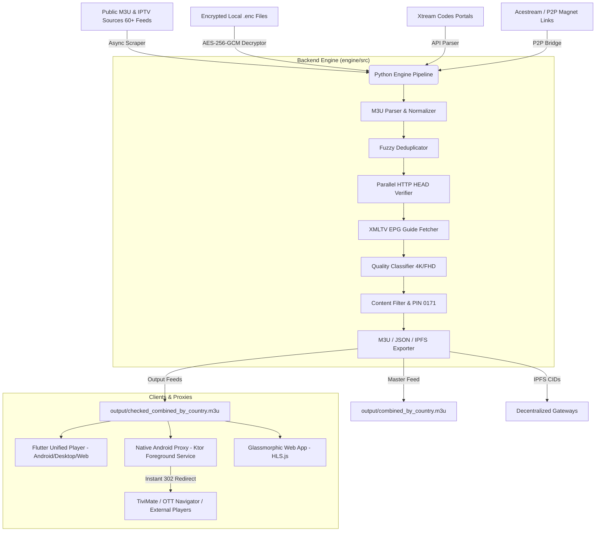

# 🏗️ ALL-IN-One IPTV — Enterprise Architecture Specification

> **The Ultimate All-In-One IPTV Ecosystem**: Automated Aggregator, Parallel Health Verifier, Smart Stream Fallback Engine, Cross-Platform Unified Player, Native Android Local Proxy, and Glassmorphic Web App.

---

## 📐 Monorepo High-Level Architecture

---

## ⚡ Core Component Specification

### 1. Backend Engine (`engine/src`)
- **Async Scraper (`scraper.py`)**: Fetches 60+ global M3U sources asynchronously using `aiohttp`.
- **Parser (`parser.py`)**: Regex-based M3U parser handling `#EXTINF`, `#EXTVLCOPT`, cookies, logos, and tvg metadata.
- **Parallel Health Verifier (`verifier.py`)**: Executes concurrent HTTP HEAD requests with domain reachability caching (verifying 10,000+ alive domains in under 4 minutes).
- **Fuzzy Search Engine (`search_engine.py`)**: Sub-millisecond `SequenceMatcher` fuzzy search for channel titles, countries, and qualities.
- **Content Filter (`content_filter.py`)**: Regex explicit content detection paired with system PIN (`0171`) authorization.
- **Acestream Bridge (`torrent_bridge.py`)**: Transforms `acestream://` and `magnet:?xt=urn:btih:` into HTTP proxy streams (`http://127.0.0.1:8080/p2p/{infohash}`).

### 2. Flutter Unified Player (`apps/app_player`)
- **UI Architecture**: Glassmorphism design system using `GoogleFonts.outfit`, deep radial mesh gradients, and `flutter_animate`.
- **Dual Mode**:
  - **Live TV Mode**: Category sidebar, EPG schedule, channel list, and mini-player.
  - **Netflix VOD Mode**: Cinematic hero header, poster card grid, and detail modals.
- **Smart Fallback Engine**: Monitors `media_kit` error events and auto-switches stream URLs within 1.5 seconds if a channel drops out.

### 3. Native Android Proxy (`apps/app_proxy`)
- **Architecture**: Android `ForegroundService` with ongoing notification hosting an embedded Ktor Netty server on `http://127.0.0.1:8080`.
- **Real-Time Redirects**: `/play/{channelId}` runs async HTTP HEAD checks across channel fallback mirrors and returns an instant `HTTP 302 Redirect` to the fastest responsive link.
- **Xtream Codes Emulation**: `/player_api.php` allows third-party IPTV apps (TiviMate, Smarters) to authenticate locally.

### 4. Glassmorphic Web App (`docs/`)
- Client-side browser application powered by HLS.js, supporting channel searching, category chips, live video streaming, and PIN modal unlocking.

---

## 🛡️ Security & Privacy Architecture

- **AES-256-GCM Encryption**: Secure local playlist storage via `engine/src/encryption.py`.
- **Header Preservation**: Preserves user-agent and cookie tokens attached to stream URLs.
- **Legal Compliance**: DMCA compliant design hosting zero media content on repository servers.
