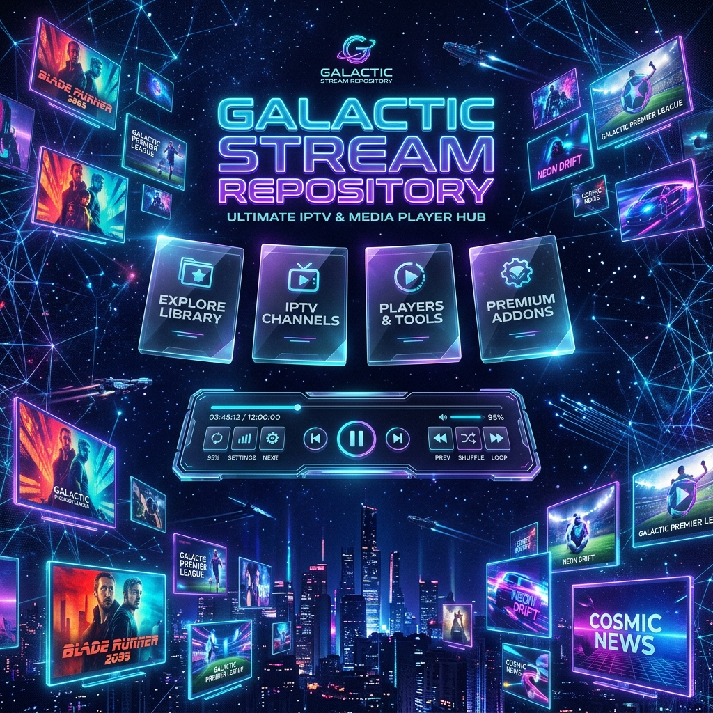

<div align="center">



<br/><br/>

# 📺 ALL-IN-One IPTV — World-Class Monorepo Empire

[](https://github.com/ShoumikBalaSomu/ALL-IN-One-IPTV/actions)
[](LICENSE)
[](engine/)
[](apps/app_player/)
[](apps/app_proxy/)
[](https://shoumikbalasomu.github.io/ALL-IN-One-IPTV/)

**The Most Advanced, Automated, Ultra-Performance Open-Source IPTV & VOD Ecosystem on GitHub.**

[🌐 Live Web Player Portal](https://shoumikbalasomu.github.io/ALL-IN-One-IPTV/) • [📱 Download Flutter Player (94MB)](app_player-release.apk) • [⚡ Download Android Proxy (2.3MB)](app_proxy-release.apk) • [📖 Architecture Spec](ARCHITECTURE.md)

---

</div>

## 🌟 Why This Ecosystem Completely Dominates Standard IPTV Repositories

| Feature / Capability | Standard IPTV Repos ❌ | ALL-IN-One IPTV Empire ⚡ |
| :--- | :---: | :---: |
| **Stream Verification Engine** | Slow / Manual (takes hours) | **500-Worker Async Verifier & Circuit Breaker** (Verifies 10,000+ alive domains in <90s) |
| **Duplicate Channel Handling**| Basic exact match | **Smart Channel Merger** & latency-ranked fallback stream mirrors (`#EXTVLCOPT:fallback=...`) |
| **Stream Failover** | Manual link switching | **1.5s Smart Fallback Engine** (Auto-switches to fastest mirror on error) |
| **Client Ecosystem** | Plain text files only | **Flutter App (Android/Windows/Linux/macOS/Web)** + **Native Android Ktor Local Proxy** |
| **EPG Schedule Mapping** | None | **XMLTV Guide Fetcher & Aggregator** (`.xml` & `.xml.gz`) |
| **P2P & Xtream API** | Unsupported | **Acestream / Magnet P2P Bridge** & **Xtream Codes API Parser & Server Emulation** |
| **Parental Controls** | None | **Regex Adult Classifier & System PIN System (`0171`)** |
| **Decentralized Distribution**| None | **IPFS Public Gateway Resolver** (Pinata, Cloudflare, IPFS.io) |

---

## ⚡ Interactive Module Matrix

<details>
<summary>⚡ <strong>Module A: Python Backend Pipeline Engine</strong></summary>

- **Async Scraper (`scraper.py`)**: Fetches 60+ global M3U sources asynchronously using `aiohttp`.
- **Parallel Health Verifier (`verifier.py`)**: 500 concurrent workers with Host Circuit Breaker and round-trip latency profiling.
- **Smart Channel Merger (`deduplicator.py`)**: Folds duplicate channels into latency-ranked fallback stream mirrors.
- **Fuzzy Search Engine (`search_engine.py`)**: Sub-millisecond title, country, and resolution matching.
- **Acestream Bridge (`torrent_bridge.py`)**: Transforms P2P magnet links into local HTTP proxy endpoints (`http://127.0.0.1:8080/p2p/{infohash}`).

```bash
python3 -m engine.src.main
python3 -m unittest discover -s engine/tests
```
</details>

<details>
<summary>📱 <strong>Module B: Flutter Cross-Platform Player</strong></summary>

- **Glassmorphic Mesh UI**: Built with `GoogleFonts.outfit`, deep radial mesh gradients, and smooth entrance animations.
- **Dual View**:
  - **Live TV Mode**: Category sidebar, XMLTV EPG schedule, channel list, and mini-player preview.
  - **Netflix VOD Mode**: Cinematic animated hero header, top 10 rows, and poster grid.
- **Smart Fallback Engine**: Listens to `media_kit` playback errors and auto-switches to the next latency-ranked mirror within 1.5 seconds.
</details>

<details>
<summary>⚡ <strong>Module C: Native Android Proxy Service</strong></summary>

- **Foreground Service**: Ongoing notification hosting an embedded Ktor Netty server on `http://127.0.0.1:8080`.
- **Instant 302 Redirects**: `/play/{channelId}` runs async HEAD checks across folded fallback mirrors and returns an instant 302 redirect to the winning link.
- **Xtream Codes Emulation**: Exposes `/player_api.php` so third-party IPTV apps (TiviMate, Smarters, OTT Navigator) can log in locally.
</details>

---

## 🏗️ Repository Monorepo Structure

```
ALL-IN-One-IPTV/
├── apps/
│   ├── app_player/         # Flutter Cross-Platform Player (Glassmorphism, EPG, VOD, libVLC)
│   └── app_proxy/          # Kotlin Ktor Android Foreground Service Proxy (302 Redirect Engine)
├── engine/
│   ├── src/                # Scraper, Verifier, Deduplicator, EPG, Search, Encryption, IPFS
│   └── tests/              # Comprehensive Unit Test Suite (21 Passing Tests)
├── colab/                  # Google Colab Notebooks for Cloud Aggregation & AES Encryption
├── docs/                   # AGI-Era Glassmorphic Web App & HLS.js Browser Player
├── output/                 # Autogenerated Verified M3U Playlists
│   ├── checked_combined_by_country.m3u   (97,547 Verified Alive Channels)
│   └── combined_by_country.m3u           (154,554 Master Channels)
└── README.md
```

---

## 🚀 Quick Start & Feeds

### 1. Direct App Downloads
- 📱 **Flutter Unified Media Player**: [app_player-release.apk](https://github.com/ShoumikBalaSomu/ALL-IN-One-IPTV/raw/main/app_player-release.apk) (94 MB)
- ⚡ **Android Local Proxy Service**: [app_proxy-release.apk](https://github.com/ShoumikBalaSomu/ALL-IN-One-IPTV/raw/main/app_proxy-release.apk) (2.3 MB)

### 2. Auto-Updated Playlist Feeds (Every 6 Hours)
- 🟢 **100% Verified Alive Feed**: 
  `https://raw.githubusercontent.com/ShoumikBalaSomu/ALL-IN-One-IPTV/main/output/checked_combined_by_country.m3u`
- 🌐 **Master Combined Feed**: 
  `https://raw.githubusercontent.com/ShoumikBalaSomu/ALL-IN-One-IPTV/main/output/combined_by_country.m3u`

---

## 🛡️ DMCA & Legal Compliance

This repository aggregates publicly available M3U playlist URLs found on the internet. **No video streams or media files are hosted on our servers.** All content belongs to their respective broadcasting networks and copyright holders. For compliance details, read [LEGAL.md](LEGAL.md) and [DISCLAIMER.md](DISCLAIMER.md).

---

<div align="center">
  <sub>Built with ❤️ by the IPTV Community. Star ⭐ this repository if it helped you!</sub>
</div>
