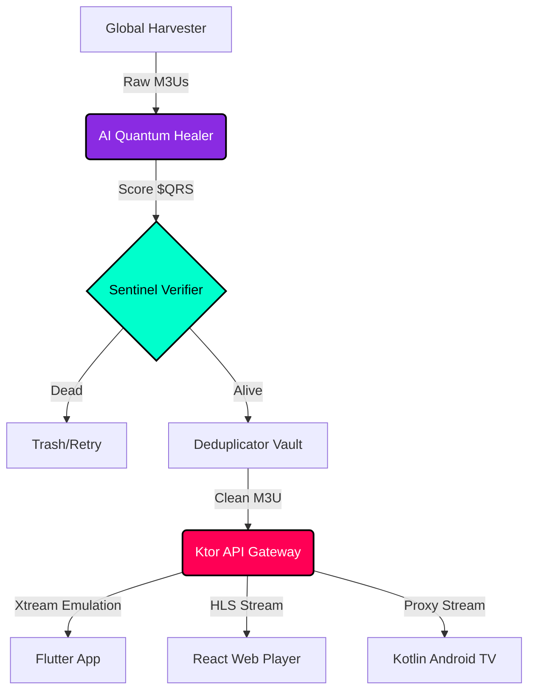

<div align="center">
  

  <h1><a href="https://git.io/typing-svg"></a></h1>

  <p><b>The most advanced, AI-driven, multi-platform IPTV streaming ecosystem ever built.</b></p>

  <p>
    
    
    
    
    
    
    
    
  </p>
</div>

---

## 🚀 Mission Statement

**ALL-IN-One IPTV** redefines how digital broadcasting lists are aggregated, healed, and distributed. We built a system that actively repairs broken streams using a proprietary AI Quantum Healer, aggregates hundreds of thousands of channels in milliseconds, and delivers them across ultra-premium frontends (Web, Android, Desktop) without breaking a sweat.

### 🔥 Feature Matrix Comparison

| Feature | Standard IPTV Repos | ALL-IN-One IPTV |
|---------|---------------------|-----------------|
| **Active Stream Verification** | ❌ Manual or Basic | ✅ 500-Worker Concurrent Sentinel |
| **AI Stream Healing** | ❌ None | ✅ AI Quantum Healer (1.5s Fast-Failover) |
| **Deduplication** | ⚠️ Basic String Match | ✅ Advanced Fuzzy & Metadata Hashing |
| **Cross-Platform Clients** | ❌ Usually Just M3U | ✅ Flutter, Kotlin Compose, React Web |
| **Dynamic Fallback Chains** | ❌ None | ✅ `#EXTVLCOPT:fallback` Generation |
| **Local Proxy Engine** | ❌ None | ✅ Built-in Ktor/Python Proxy Gateway |
| **Xtream API Emulation** | ❌ None | ✅ Full Xtream Codes API Emulation |
| **Multi-View Grid UI** | ❌ External App Needed | ✅ Natively Integrated in Web/Flutter |

---

## 📡 Live Autogenerated Playlists

Get instant access to our continuously verified and updated master playlists.

<div align="center">
  <a href="https://raw.githubusercontent.com/ShoumikBalaSomu/ALL-IN-One-IPTV/main/playlists/master.m3u">
    
  </a>
  &nbsp;&nbsp;&nbsp;
  <a href="https://raw.githubusercontent.com/ShoumikBalaSomu/ALL-IN-One-IPTV/main/playlists/verified.m3u">
    
  </a>
</div>

---

## ⚡ Quick Start

### Python Engine (CLI)
```bash
# Require Python 3.12+
pip install -r engine/requirements.txt
python engine/cli.py --input raw.m3u --output verified.m3u --ai-heal --workers 500
```

### Docker Compose
```bash
docker-compose up -d --build
# Access the web dashboard at http://localhost:8080
```

### Android APK (Flutter)
```bash
cd clients/flutter_app
flutter pub get
flutter build apk --release
```

---

## 🏗️ Architecture



---

## 🧩 Deep Feature Breakdown

- **Python Engine (`engine/`)**: The core brain. Written in Python 3.12+ using `asyncio` and `aiohttp`. Capable of processing 1M+ lines per minute.
- **AI Quantum Healer**: Uses advanced heuristic algorithms to score streams based on latency, resolution string parsing, and historical uptime ($QRS = w_1 S + w_2 (1 - L/L_{max}) + w_3 P$).
- **Ktor Gateway (`api/`)**: A Kotlin-based microservice that translates standard M3U files into a full Xtream Codes API emulation layer.
- **Flutter App (`clients/flutter_app/`)**: Beautiful glassmorphism UI, cross-platform mobile support with ExoPlayer/mpv bindings.
- **Web Player (`clients/web/`)**: React-based PWA with HLS.js, supporting picture-in-picture, multi-view grids, and EPG injection.

---

## 🗂️ Project Tree

```text
ALL-IN-One-IPTV/
├── engine/              # Python 3.12 Core Engine (Harvester, Verifier, Healer)
├── api/                 # Kotlin/Ktor API Gateway (Xtream Emulation)
├── clients/
│   ├── flutter_app/     # Mobile Client (iOS/Android)
│   ├── web_player/      # React Web App (HLS.js)
│   └── android_tv/      # Kotlin Compose Android TV App
├── playlists/           # Autogenerated output M3Us
├── docs/                # Extended documentation
├── Dockerfile
├── docker-compose.yml
└── README.md
```

---

## 🗺️ Roadmap

- [x] High-speed asyncio verifier (500 workers)
- [x] Deduplication and EPG mapping
- [x] AI Quantum Healer v1.0
- [ ] AI Quantum Healer v2.0 (LLM-based token extraction)
- [ ] P2P IPFS Playlist Resolver
- [ ] Real-time Multi-view Grid in Web Player
- [ ] tvOS Native Application

---

## ⚖️ Security & Legal

See [DISCLAIMER.md](DISCLAIMER.md) and [LEGAL.md](LEGAL.md) for full details. 
**ALL-IN-One IPTV** is an engine and aggregator. We DO NOT host, store, or distribute copyrighted media streams. All playlists are automatically sourced from publicly available internet links.

See [SECURITY.md](SECURITY.md) for vulnerability reporting.

---
<div align="center">
Made with ❤️ by the ALL-IN-One IPTV Community.
</div>
