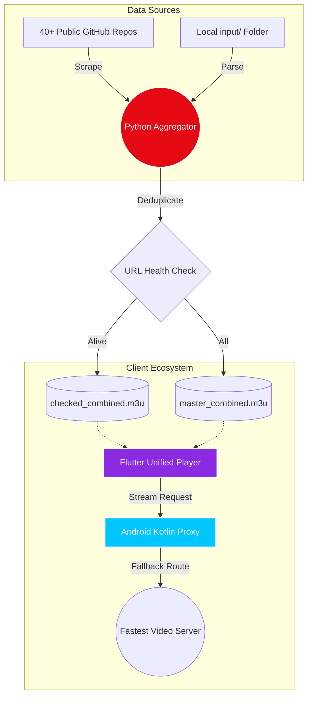

<!-- Header Banner -->

<!-- Typing Effect Subtitle -->

 

<!-- Badges Grid -->

  
  
  
  
  

> **Our Dream:** To engineer the most powerful, automated, and visually breathtaking IPTV ecosystem in existence. Completely free, transparent, and built for the community.

[📖 Read the Full Architecture & Vision in ABOUT.md](./ABOUT.md)

---

 

## 🚀 Live Autogenerated Playlists

These links are scraped, deduplicated, and validated **every single day**. Plug these directly into your TV, phone, or our custom player!

<table align="center" width="100%">
  <tr>
    <td align="center" width="50%">
      <h3>🌍 Master Global Archive</h3>
      
The massive collection, expertly folded and grouped by country.

       
      
    </td>
    <td align="center" width="50%">
      <h3>🟢 100% Verified Alive</h3>
      
Tested via concurrent proxy. Contains <b>zero dead links</b>.

       
      
    </td>
  </tr>
</table>

 

## 🔮 The Core Ecosystem

We didn't just build a scraper; we built an entire suite of ultra-premium applications.

<table width="100%">
  <tr>
    <td width="33%" align="center">
       
      <b>1. Unified Player</b> <i>(app_player/)</i>  
      An absolute visual masterpiece built in Flutter. Features deep-space particle animations, glassmorphism UI, a Netflix-style Cinema Mode, and an OTT Navigator-inspired Live TV EPG.
    </td>
    <td width="33%" align="center">
       
      <b>2. Proxy Optimizer</b> <i>(app_proxy/)</i>  
      A Jetpack Compose cyber-dashboard for Android. Runs silently in the background, intercepting video requests to instantly route you to the fastest fallback server if a link dies.
    </td>
    <td width="33%" align="center">
       
      <b>3. The Aggregator</b> <i>(aggregator.py)</i>  
      The asynchronous Python brain. It scrapes 40+ repos, ingests your local <code>input/</code> folders, deduplicates streams, and tests thousands of links concurrently via HTTP HEAD.
    </td>
  </tr>
</table>

 

## 🏗️ System Architecture

 

## 🗺️ Roadmap to the Future

| Feature | Progress | Status |
| :--- | :---: | :---: |
| **Premium Flutter UI/UX Overhaul** | `██████████` 100% | ✅ Complete |
| **Jetpack Compose Proxy Engine** | `██████████` 100% | ✅ Complete |
| **Concurrent Python Aggregator** | `██████████` 100% | ✅ Complete |
| **Torrent IPTV (P2P WebRTC)** | `████░░░░░░` 40% | 🚧 In Progress |
| **AI Content Discovery** | `░░░░░░░░░░` 0% | 📅 Planned |

 

## ⚖️ Legal Disclaimer

> **Notice:** We do not own, host, retransmit, or broadcast any of the streams or media provided in this repository. We merely aggregate publicly available hyperlinks found across the internet. This tool is for educational purposes. Users are responsible for ensuring they comply with local laws.

 

  

