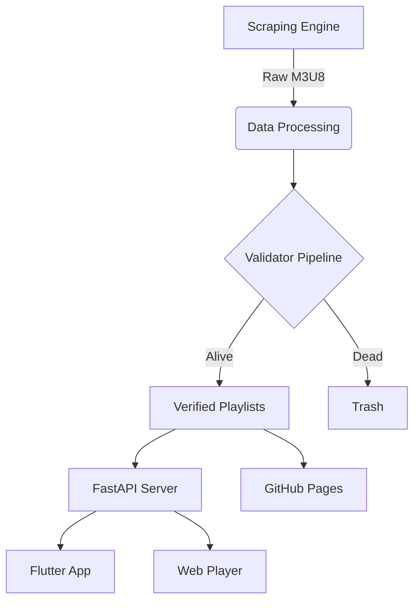

<div align="center">
  
  
  

  <p align="center">
    <strong>A robust, automated ecosystem for aggregating, validating, and serving global IPTV streams.</strong>
  </p>

  <div>
    <a href="https://github.com/ShoumikBalaSomu/ALL-IN-One-IPTV/actions"></a>
    <a href="https://github.com/ShoumikBalaSomu/ALL-IN-One-IPTV/blob/main/LICENSE"></a>
    <a href="https://github.com/ShoumikBalaSomu/ALL-IN-One-IPTV/stargazers"></a>
    
    
    
  </div>
</div>

<br/>

## 📖 Table of Contents
- [🚀 Live Autogenerated Playlists](#-live-autogenerated-playlists)
- [🔮 Core Ecosystem](#-core-ecosystem)
- [📦 Quick Start](#-quick-start)
- [🏗️ Architecture](#️-architecture)
- [📱 Apps](#-apps)
- [🗺️ Roadmap](#️-roadmap)
- [⚖️ Legal Disclaimer](#️-legal-disclaimer)
- [📄 License](#-license)

---

## 🚀 Live Autogenerated Playlists

Our bots continuously scrape, merge, and validate global IPTV streams. You can use these playlists in your favorite player.

<div align="center">
  <table>
    <tr>
      <th align="center">Playlist Type</th>
      <th align="center">Description</th>
      <th align="center">Link</th>
    </tr>
    <tr>
      <td align="center"><strong>Master Global Archive</strong></td>
      <td align="center">All aggregated streams across the globe. Unfiltered.</td>
      <td align="center"><a href="https://raw.githubusercontent.com/ShoumikBalaSomu/ALL-IN-One-IPTV/main/output/combined_by_country.m3u"></a></td>
    </tr>
    <tr>
      <td align="center"><strong>100% Verified Alive</strong></td>
      <td align="center">Only streams that pass our rigorous liveness checks.</td>
      <td align="center"><a href="https://raw.githubusercontent.com/ShoumikBalaSomu/ALL-IN-One-IPTV/main/output/checked_combined_by_country.m3u"></a></td>
    </tr>
  </table>
</div>

---

## 🔮 Core Ecosystem

We provide more than just lists. We provide a full ecosystem.

| Feature | Description | Status |
| :--- | :--- | :---: |
| **🤖 Scraper Engine** | Asynchronous Python bots crawling reliable sources. | ✅ |
| **⚡ Validator** | High-concurrency liveness checking with async streams. | ✅ |
| **🌐 API Server** | FastAPI based REST API for programmatic access. | ✅ |
| **📱 Cross-Platform** | Flutter Mobile/Desktop Apps & Modern Web Player. | 🚧 |

---

## 📦 Quick Start

### Python (Local Setup)
```bash
# Clone the repository
git clone https://github.com/ShoumikBalaSomu/ALL-IN-One-IPTV.git
cd ALL-IN-One-IPTV

# Install dependencies (Python 3.12+ recommended)
pip install -r requirements.txt

# Run the full pipeline (Scrape -> Merge -> Validate)
python -m iptv run
```

### Docker
```bash
# Pull and run the automated pipeline
docker pull shoumikbalasomu/all-in-one-iptv:latest
docker run -d --name iptv-pipeline shoumikbalasomu/all-in-one-iptv
```

---

## 🏗️ Architecture



---

## 📱 Apps

Experience the ALL-IN-ONE ecosystem on your own devices.

- **📱 Flutter App:** A premium mobile experience with built-in EPG, favorites, and Chromecast support.
- **🌐 Web Player:** A modern React/Vite web application for instant viewing anywhere.

*Stay tuned for the official release of our apps!*

---

## 🗺️ Roadmap

- [x] v1.0: Basic Scraper & Merger
- [x] v2.0: Full Async Refactoring & Validator
- [ ] v2.1: FastAPI Integration
- [ ] v3.0: Web Player Beta
- [ ] v3.5: Flutter Mobile App Release
- [ ] v4.0: Machine Learning Content Categorization

---

## ⚖️ Legal Disclaimer

See our full [DISCLAIMER.md](DISCLAIMER.md) and [LEGAL.md](LEGAL.md).
**ALL-IN-ONE IPTV** is an indexing tool. We do not host, store, or distribute any media files. We only provide links to third-party content freely available on the internet.

---

## 📄 License

This project is licensed under the MIT License - see the [LICENSE](LICENSE) file for details.

<div align="center">
  <a href="https://star-history.com/#ShoumikBalaSomu/ALL-IN-One-IPTV&Date">
    
  </a>
</div>
